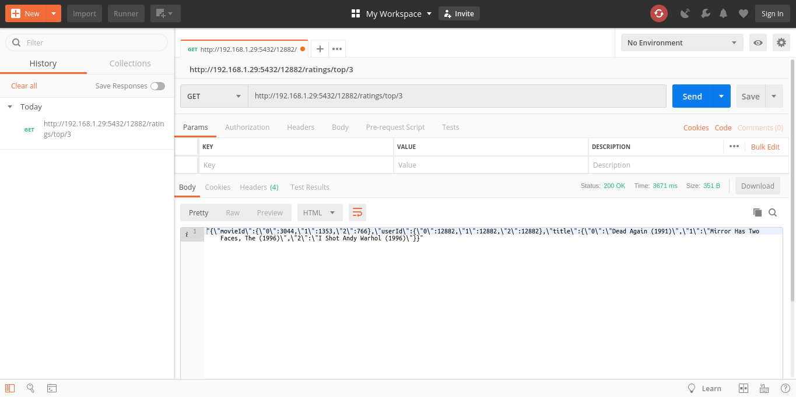
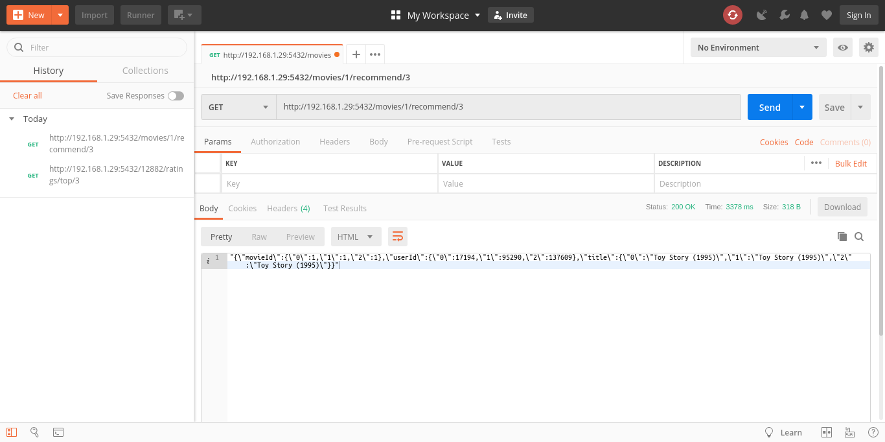
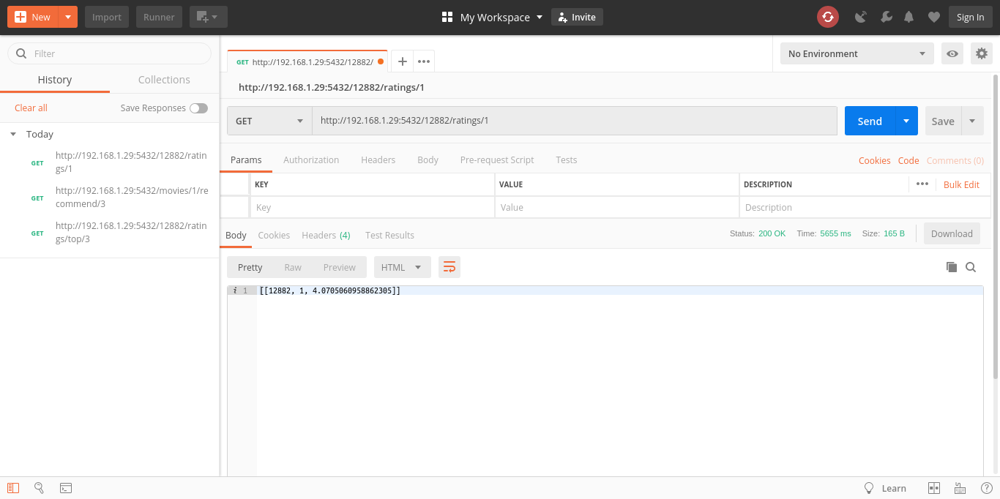
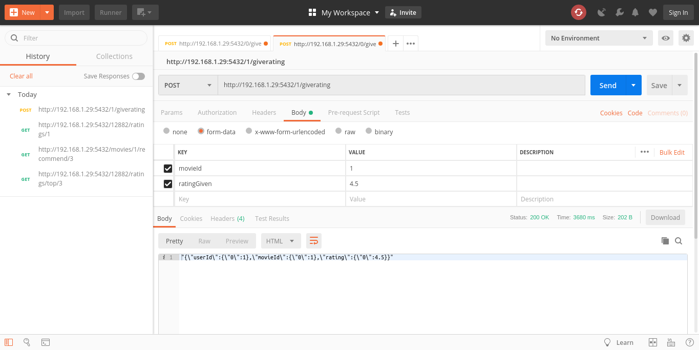
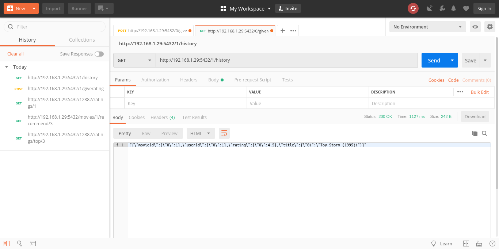

# Aplikasi REST API Recommendation System dengan Menggunakan Flask
## Deskripsi Aplikasi
### [App.py](https://github.com/udinIMM/bigdata/blob/master/tugas-4/app.py)
`App.py` is a Flask web application that defines a RESTful-like API around the engine.

### [Engine.py](https://github.com/udinIMM/bigdata/blob/master/tugas-4/engine.py)
`Engine.py` defines the recommendation engine, wrapping insde all the Spark related computations.

### [Server.py](https://github.com/udinIMM/bigdata/blob/master/tugas-4/server.py)
`Server.py` initialises a CherryPy webserver after creating a Spark context and Flask web app using the previous.

## URL / End Point yang Bisa Diakses
### Menampilkan Rekomendasi Beberapa Film untuk User
Method = **[GET]**
`http://<IP_SERVER>:5432/<userId>/ratings/top/<count>` 
- Menampilkan rekomendasi film sejumlah `<count>` untuk *user* `<userId>`

  
### Menampilkan Film untuk Direkomendasikan ke Beberapa User
Method = **[GET]**
`http://<IP_SERVER>:5432/movies/<movieId>/recommend/<count>` 
- Menampilkan film `<movieId>` untuk direkomendasikan ke sejumlah `<count>` *user*

  
### Memprediksi User Memberikan Rating terhadap Suatu Film
Method = **[GET]**
`http://<IP_SERVER>:5432/<userId>/ratings/<movieId>`
- Memprediksi *user* `<userId>` memberikan *rating* terhadap film `<movieId>`

  
### User Memberikan Rating untuk Suatu Film
Method = **[POST]**
`http://<IP_SERVER>:5432/<userId>/giverating` 
- `<user_id>` memberikan *rating* untuk film `<movieId>`. Masukkan *key* berupa `<movieId>` dan `<ratingGiven>` beserta *value* / nilai dari masing-masing *key* tersebut pada ***body request***.

  
### Melihat Riwayat Pemberian Rating oleh Suatu User
Method = **[GET]**
`http://<IP_SERVER>:5432/<userId>/history` 
- Melihat riwayat pemberian *rating* oleh *user* `<userId>`

## Referensi
- https://github.com/jadianes/spark-movie-lens/blob/master/notebooks/online-recommendations.ipynb

### Dibuat oleh :
#### Ilham Muhammad Misbahuddin
#### 05111540000088
  